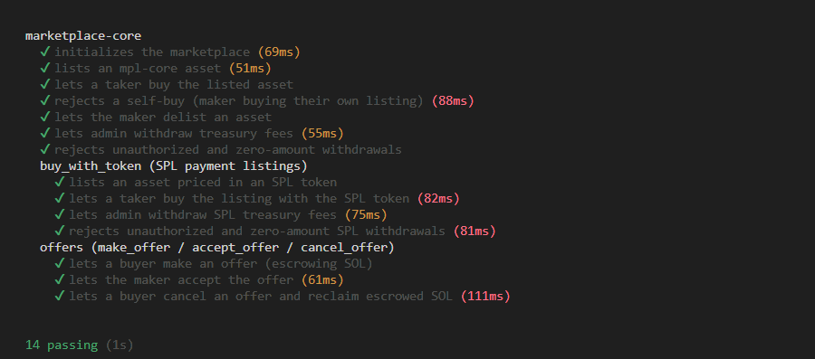

# anchor-marketplace-core

An Anchor program on Solana implementing a trustless NFT marketplace for **MPL Core** assets. Sellers list their assets on-chain, buyers purchase them with SOL or an SPL token, and a configurable fee is routed to a treasury. Buyers can also make standing SOL offers on a listed asset. Buyers receive a fungible reward token on every purchase.

Program ID: `3xhZuCq1ddQwWayATgBE1QFqjJ1BUyyXH4j73FJzbBgV`

## Test Results



## Features

- **Initialize** — deploy a named marketplace instance with a fee in basis points (0–10 000) and a PDA-controlled reward mint
- **List** — transfer an MPL Core asset into a listing PDA and record the asking price, optionally denominated in an SPL token
- **Buy** — atomically pay the maker in SOL, route the fee to the treasury, transfer the asset to the buyer, and mint one reward token to the buyer
- **Buy with Token** — same as `buy`, but payment is an SPL token (`token_interface::transfer_checked`), split between the maker's ATA and the treasury's ATA
- **Delist** — return the asset to the maker and close the listing account (rent reclaimed)
- **Make Offer** — escrow SOL into an `Offer` PDA to bid on a listed asset, independent of the listed price
- **Accept Offer** — maker accepts a buyer's offer instead of the listed price; settles payment, transfers the asset, mints a reward, and closes both the `Listing` and `Offer` accounts
- **Cancel Offer** — buyer reclaims escrowed SOL and closes the `Offer` account
- **Withdraw Fees** — allow the admin to pull accumulated SOL from the treasury
- **Withdraw Token Fees** — allow the admin to pull accumulated SPL token fees from the treasury ATA

## Architecture

### Accounts

| Account | Seeds | Description |
|---------|-------|-------------|
| `Marketplace` | `["marketplace", name]` | Stores admin, fee (bps), and bump cache |
| `Treasury` | `["treasury", marketplace]` | Holds SOL fee lamports (and is the authority of the treasury token ATA); a bare `SystemAccount` |
| `RewardMint` | `["rewards", marketplace]` | SPL token mint; authority is the marketplace PDA |
| `Listing` | `["listing", asset]` | Records maker, asset address, price, `payment_mint`, and bump |
| `Offer` | `["offer", asset, buyer]` | Records buyer, asset, escrowed SOL amount, and bump |

`Listing.payment_mint` is `Pubkey::default()` for SOL-denominated listings, or an SPL mint address for token-denominated listings.

### Instruction Flow

```
initialize(name, fee)
  └─ creates Marketplace + Treasury PDA + RewardMint

list(price, payment_mint?)
  └─ creates Listing PDA (payment_mint = default() for SOL, or an SPL mint)
  └─ MPL Core TransferV1: maker → listing PDA

buy()
  ├─ SOL: taker → maker  (price − fee)
  ├─ SOL: taker → treasury  (fee)
  ├─ MPL Core TransferV1: listing PDA → taker  (PDA signs)
  ├─ close Listing → maker  (rent returned)
  └─ mint 1 reward token → taker ATA

buy_with_token()
  ├─ transfer_checked: taker ATA → maker ATA  (price − fee, payment_mint)
  ├─ transfer_checked: taker ATA → treasury ATA  (fee, payment_mint)
  ├─ MPL Core TransferV1: listing PDA → taker  (PDA signs)
  ├─ close Listing → maker  (rent returned)
  └─ mint 1 reward token → taker ATA

delist()
  ├─ MPL Core TransferV1: listing PDA → maker  (PDA signs)
  └─ close Listing → maker  (rent returned)

make_offer(amount)
  ├─ creates Offer PDA  (buyer, asset, amount)
  └─ SOL: buyer → offer PDA  (escrowed)

accept_offer()
  ├─ MPL Core TransferV1: listing PDA → buyer  (PDA signs)
  ├─ mint 1 reward token → buyer ATA
  ├─ lamports: offer PDA → maker  (offer.amount − fee)
  ├─ lamports: offer PDA → treasury  (fee)
  ├─ close Listing → maker  (rent returned)
  └─ close Offer → buyer  (remaining rent returned)

cancel_offer()
  └─ close Offer → buyer  (escrowed amount + rent returned)

withdraw_fees(amount)
  └─ SOL: treasury PDA → admin  (treasury PDA signs)

withdraw_token_fees(amount)
  └─ transfer_checked: treasury ATA → admin ATA  (marketplace PDA signs)
```

### Fee Calculation

```
fee = amount × fee_bps / 10_000   (amount is the listing price or offer amount)
maker_receives = amount − fee
```

The intermediate product is widened to `u128` before dividing to avoid overflow.

## Security Properties

- **No self-buy** — `buy` / `buy_with_token` enforce `taker ≠ maker` via `require_keys_neq!`
- **Admin-only withdrawals** — `withdraw_fees` / `withdraw_token_fees` use `has_one = admin` on the marketplace account
- **Zero-amount guard** — withdrawal of 0 lamports/tokens is rejected
- **Overflow-safe fee math** — intermediate product is widened to `u128` before division
- **Asset custody via PDAs** — the listing PDA becomes the mpl-core asset owner; it signs transfers using `invoke_signed`
- **SOL escrow via PDAs** — `make_offer` escrows lamports directly on the program-owned `Offer` PDA; `accept_offer` / `cancel_offer` settle by adjusting lamport balances and rely on Anchor's `close` constraint to return any remaining rent
- **Token-2022 ready** — payments and rewards use `anchor_spl::token_interface` (`Interface<TokenInterface>`, `InterfaceAccount<Mint>` / `InterfaceAccount<TokenAccount>`), compatible with both the legacy Token program and Token-2022

## Prerequisites

| Tool | Version |
|------|---------|
| Rust / Cargo | stable (see `rust-toolchain.toml`) |
| Solana CLI | 1.18+ |
| Anchor CLI | 0.32.x |
| Node.js | 18+ |
| Yarn | 1.x |

## Getting Started

```bash
# Install JS dependencies
yarn install

# Build the program
anchor build

# Run all tests against a local validator
anchor test
```

The test validator automatically clones the MPL Core program from mainnet (`CoREENxT6tW1HoK8ypY1SxRMZTcVPm7R94rH4PZNhX7d`) so no manual setup is needed.

## Tests

All 14 tests pass:

| Test | What it verifies |
|------|-----------------|
| initializes the marketplace | Marketplace account fields, reward mint decimals and authority |
| lists an mpl-core asset | Listing account fields, asset owner becomes the listing PDA |
| lets a taker buy the listed asset | Asset owner becomes taker, listing closes, maker receives price minus fee, treasury receives fee, taker receives 1 reward token |
| rejects a self-buy | `SelfBuyNotAllowed` error returned when taker == maker |
| lets the maker delist an asset | Asset returns to maker, listing closes |
| lets admin withdraw treasury fees | Treasury balance decreases, admin balance increases by exact amount |
| rejects unauthorized and zero-amount withdrawals | `ConstraintHasOne` for non-admin, `InvalidWithdrawAmount` for zero |
| lists an asset priced in an SPL token | Listing's `payment_mint` is set to the SPL mint, asset owner becomes the listing PDA |
| lets a taker buy the listing with the SPL token | `transfer_checked` splits payment between maker ATA and treasury ATA, asset transfers to taker, taker earns a reward |
| lets admin withdraw SPL treasury fees | Treasury ATA balance decreases, admin ATA balance increases by exact amount |
| rejects unauthorized and zero-amount SPL withdrawals | `ConstraintHasOne` for non-admin, `InvalidWithdrawAmount` for zero |
| lets a buyer make an offer (escrowing SOL) | `Offer` PDA created with correct buyer/asset/amount, escrowed lamports present |
| lets the maker accept the offer | Asset transfers to buyer, `Listing` and `Offer` accounts close, maker/treasury receive the offer-amount split, buyer reclaims offer rent, buyer earns a reward |
| lets a buyer cancel an offer and reclaim escrowed SOL | Buyer's SOL balance increases by the escrowed amount, `Offer` account closes |

## Project Structure

```
programs/anchor-marketplace-core/src/
├── lib.rs                    # Program entrypoint and instruction dispatchers
├── state.rs                  # Marketplace, Listing, and Offer account structs
├── errors.rs                 # Custom error codes
└── instructions/
    ├── initialize.rs
    ├── list.rs
    ├── buy.rs
    ├── buy_with_token.rs
    ├── delist.rs
    ├── make_offer.rs
    ├── accept_offer.rs
    ├── cancel_offer.rs
    ├── withdraw_fees.rs
    └── withdraw_token_fees.rs
tests/
└── anchor-marketplace-core.ts   # Full integration test suite
```

## Dependencies

- [anchor-lang](https://crates.io/crates/anchor-lang) `0.32.1`
- [anchor-spl](https://crates.io/crates/anchor-spl) `0.32.1`
- [mpl-core](https://crates.io/crates/mpl-core) `0.11.2` (with `anchor` feature)
